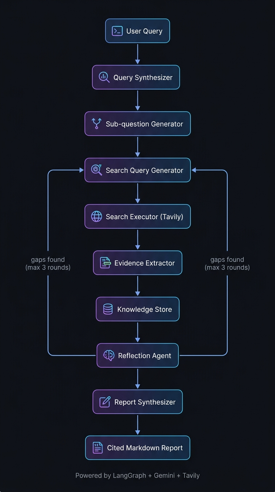

# 🔍 Anveshaka — अन्वेषक

**The one who investigates.** An autonomous deep research agent powered by **LangGraph**, **Google Gemini**, and **Tavily**. Give it a question — it researches, reflects, iterates, and delivers a cited markdown report.

<p align="center">
  
</p>

## How It Works

Anveshaka decomposes complex queries into sub-questions, runs multi-round web searches with automatic quality filtering, extracts evidence via LLM, reflects on coverage gaps, and synthesizes everything into a structured research report with inline citations.

### Pipeline Stages

| Stage | Agent | What It Does |
|-------|-------|-------------|
| 1 | **Query Synthesizer** | Analyzes the query — extracts intent, scope, entities, and determines if it's single or multi-question |
| 2 | **Sub-question Generator** | Decomposes complex queries into independently researchable sub-questions (3–6 facets) |
| 3 | **Search Query Generator** | Creates 2–4 diverse, angle-based search queries per sub-question |
| 4 | **Search Executor** | Runs Tavily web searches with quality filtering (removes junk, PDF artifacts, link-heavy pages) |
| 5 | **Evidence Extractor** | LLM extracts factual claims from search results, traceable to individual sources |
| 6 | **Knowledge Store** | Accumulates evidence across rounds with per-sub-question tracking |
| 7 | **Reflection Agent** | Evaluates coverage depth, source diversity, and specificity — loops back if gaps found (max 3 rounds) |
| 8 | **Report Synthesizer** | Generates a detailed markdown report with inline citations `[1]`, `[2]` and a references section |

## Features

- **Iterative Research Loop** — Up to 3 rounds of search → extract → reflect, narrowing gaps each round
- **Structured Query Analysis** — Classifies intent, scope, and architecture before decomposition
- **Intelligent Decomposition** — Breaks multi-faceted queries into independently researchable sub-questions
- **Diverse Search Angles** — Generates 2–4 angle-based queries per sub-question (not just rephrasings)
- **Quality Filtering** — Removes junk results: short content, PDF extraction artifacts, link-heavy pages
- **Evidence Deduplication** — URL-level dedup within sub-question batches prevents duplicate extraction
- **Gap-Aware Reflection** — Evaluates evidence depth, source diversity, and specificity before deciding to loop
- **Cited Reports** — Final output uses numbered inline citations mapped to source URLs
- **Interactive Frontend** — Streamlit UI with real-time pipeline progress and rendered reports
- **API Server** — FastAPI with both blocking (`POST /research`) and streaming (`GET /research/stream`) endpoints
- **Throttled LLM Calls** — Semaphore-based concurrency control to avoid hitting API rate limits

## Sample Output

Check out a real research report generated by Anveshaka:

📄 **[Sample Report: Effects of Creatine Supplementation](examples/sample_report_creatine_supplementation.md)** — A 24KB, multi-section report with executive summary, thematic analysis, inline citations, and references.

## Setup

### Prerequisites

- **Python 3.13+**
- **[uv](https://docs.astral.sh/uv/)** — Python package manager
- **Tavily API Key** — [app.tavily.com](https://app.tavily.com)
- **Google Gemini API Key** — [aistudio.google.com](https://aistudio.google.com)

### Installation

```bash
# Clone the repo
git clone https://github.com/AdetyaJamwal04/Anveshaka-The-One-Who-Investigates..git
cd Anveshaka-The-One-Who-Investigates.

# Install dependencies
uv sync
```

### Configuration

Create a `.env` file in the project root:

```env
TAVILY_API_KEY=your_tavily_key_here
GEMINI_API_KEY=your_gemini_key_here
```

Optionally set the model (defaults to `gemini-3.5-flash-lite`):

```env
MODEL_NAME=gemini-3.5-flash-lite
```

## Usage

### 🚀 Production Web App (Next.js + FastAPI)

1. **Start the backend server:**
```bash
uv run python -m uvicorn backend.api:app --host 127.0.0.1 --port 8000 --reload
```

2. **Start the Next.js frontend:**
```bash
cd frontend
npm run dev
```

Open [http://localhost:3000](http://localhost:3000) in your browser for the full Anveshaka research experience.

---

### 🖥️ Streamlit Frontend (Alternative)

```bash
uv run streamlit run backend/app.py
```

### CLI — Standalone Pipeline

```bash
# Run via LangGraph (recommended)
uv run python backend/graph.py

# Run via imperative loop (alternative)
uv run python backend/main.py
```

Reports are automatically saved to `reports/` with topic-based timestamped filenames.

### API Server

```bash
uv run python -m uvicorn backend.api:app --host 127.0.0.1 --port 8000 --reload
```

#### Endpoints

| Method | Endpoint | Description |
|--------|----------|-------------|
| `GET` | `/health` | Health check |
| `POST` | `/research` | Blocking research — returns full report |
| `GET` | `/research/stream` | Real-time SSE stream with granular agent events |
| `GET` | `/reports` | List all saved research reports |
| `GET` | `/reports/{filename}` | Retrieve a specific report markdown |

#### POST /research

```bash
curl -X POST http://127.0.0.1:8000/research \
  -H "Content-Type: application/json" \
  -d '{"query": "Impact of quantum computing on cryptography"}'
```

#### GET /research/stream (SSE)

```bash
curl -N "http://127.0.0.1:8000/research/stream?query=Impact+of+quantum+computing+on+cryptography"
```

## Testing

```bash
uv run pytest -v
```

Tests cover pure-logic components (quality filtering, deduplication, knowledge store, coverage checks) without requiring external API keys.

## Project Structure

```
Anveshaka/
├── backend/
│   ├── agents/
│   │   ├── query_synthesizer.py      # Stage 1 — Structured query analysis
│   │   ├── subquestion_generator.py  # Stage 2 — Query decomposition
│   │   ├── search_query_generator.py # Stage 3 — Diverse search query generation
│   │   ├── search_executor.py        # Stage 4 — Tavily search + quality filtering
│   │   ├── content_processor.py      # Stage 5 — LLM evidence extraction
│   │   ├── knowledge_store.py        # Stage 6 — In-memory evidence accumulator
│   │   ├── reflection.py             # Stage 7 — Coverage evaluation + gap detection
│   │   └── report_synthesizer.py     # Stage 8 — Final report generation
│   ├── models/
│   │   ├── model.py                  # Throttled Gemini LLM client
│   │   └── web_client.py             # Async Tavily client
│   ├── schemas/
│   │   └── schema.py                 # Pydantic data models
│   ├── tests/
│   │   ├── test_search_executor.py   # Quality filter unit tests
│   │   ├── test_content_processor.py # Dedup logic tests
│   │   ├── test_knowledge_store.py   # Knowledge store accessor tests
│   │   ├── test_search_query_gen.py  # Coverage fill tests
│   │   └── test_utils.py             # Slug generation tests
│   ├── api.py                        # FastAPI server with SSE streaming
│   ├── graph.py                      # LangGraph state machine
│   ├── main.py                       # CLI runner (imperative loop)
│   ├── config.py                     # Environment config loader
│   ├── utils.py                      # Filename and slug helpers
│   └── app.py                        # Streamlit prototype UI
├── frontend/                         # Next.js 15 App Router frontend
│   ├── app/
│   │   ├── page.tsx                  # Aurora landing page
│   │   ├── research/page.tsx         # Live research dashboard
│   │   ├── report/[id]/page.tsx      # Cited report viewer with ToC
│   │   ├── layout.tsx                # Inter font & SEO layout
│   │   └── globals.css               # Linear/Vercel dark design tokens
│   ├── components/
│   │   ├── Navbar.tsx                # Glassmorphism navbar
│   │   ├── PipelineTracker.tsx       # Live stage stepper
│   │   ├── LiveActivity.tsx          # Real-time event log
│   │   └── ResearchFacets.tsx        # Sub-question status cards
│   ├── lib/
│   │   ├── api.ts                    # Backend SSE & REST client
│   │   └── types.ts                  # TypeScript types
│   └── package.json
├── examples/
│   └── sample_report_creatine_supplementation.md
├── assets/
│   └── architecture.jpg              # Architecture diagram
├── reports/                          # Saved markdown reports
├── pyproject.toml                    # Python dependencies & pytest config
└── .env                              # API keys
```

## Deployment

### Architecture

```
┌─────────────────────────────────────────────────────────────┐
│                      Client (Browser)                       │
└──────────────────────────────┬──────────────────────────────┘
                               │
                               ▼
┌─────────────────────────────────────────────────────────────┐
│               Frontend (Firebase App Hosting)               │
│                   Next.js 15 SSR / Edge                     │
└──────────────────────────────┬──────────────────────────────┘
                               │ Server-Side Proxy (SSE Stream)
                               ▼
┌─────────────────────────────────────────────────────────────┐
│                 Backend (Google Cloud Run)                  │
│                     FastAPI + Uvicorn                       │
│           (LangGraph + Gemini 3.5 + Tavily API)             │
└─────────────────────────────────────────────────────────────┘
```

### 1. Backend (Google Cloud Run)

The FastAPI backend is containerized via the included `Dockerfile` and optimized for Google Cloud Run with serverless autoscaling and resilient SSE streaming (heartbeat pings prevent proxy disconnects):

1. **Authenticate and set project:**
   ```bash
   gcloud auth login
   gcloud config set project YOUR_PROJECT_ID
   ```

2. **Deploy from repository root:**
   ```bash
   gcloud run deploy anveshaka-backend \
     --source . \
     --region us-central1 \
     --port 8000 \
     --allow-unauthenticated \
     --set-env-vars="TAVILY_API_KEY=your_tavily_key,GEMINI_API_KEY=your_gemini_key,MODEL_NAME=gemini-3.5-flash-lite"
   ```
   > The `.gcloudignore` file ensures `frontend/`, `.venv/`, and dev caches are excluded from the Cloud Build upload.

3. **Copy the deployed Service URL:**
   ```
   Service URL: https://anveshaka-backend-xxxxxx.us-central1.run.app
   ```

### 2. Frontend (Firebase App Hosting)

The Next.js 15 frontend utilizes Server-Side Rendering (SSR) and API Route proxies, deployed via Firebase App Hosting:

1. **Install Firebase CLI & login:**
   ```bash
   npm install -g firebase-tools
   firebase login
   ```

2. **Configure backend URL in `frontend/apphosting.yaml`:**
   ```yaml
   env:
     - variable: BACKEND_URL
       value: https://anveshaka-backend-xxxxxx.us-central1.run.app
       availability:
         - BUILD
         - RUNTIME
   ```

3. **Deploy frontend:**
   ```bash
   cd frontend
   firebase deploy
   ```

## Tech Stack

| Component | Technology |
|-----------|-----------|
| LLM | Google Gemini (via `langchain-google-genai`) |
| Agent Orchestration | LangGraph |
| Web Search | Tavily API |
| Production Frontend | Next.js 15, React 19, Tailwind CSS |
| Prototype Frontend | Streamlit |
| API Framework | FastAPI + Uvicorn (SSE streaming) |
| Data Validation | Pydantic v2 |
| Package Management | uv |

## License

Distributed under the [MIT License](LICENSE). See `LICENSE` for more information.
Copyright (c) 2026 Adetya Jamwal.
